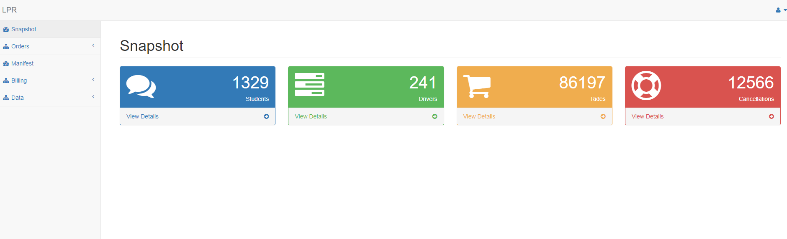

# Digital-Age-Transportation-Assistant
<p>
   LPR Ground Transportation is a business providing services in the field of Transportation. The administration maintains documentation of the services provided.  Digital-Age-Transportation-Assistant portal was designed to digitalize the manual process and make life easy for the administrator. The administrator can add orders, monitor the rides, pay the driver, bill the client and many more using the portal. 
  </p>
  
## Technologies  
```
XAMPP, jQuery, JavaScript, Ajax, Bootstrap, CSS
```
  
<p>
This project was designed to work in internal network. The following are the minimal steps required to setup the environment.</p>  
<ul>
  <li>
Install PHP XAMPP stack
 </li><li>
Start the APACHE and MYSQL module in the XAMP control panel.
 </li><li>
Load the database in the phpMyAdmin (http://localhost/phpmyadmin/)
 </li><li>
  Kickstart the system with the URL “http://localhost/lpr/pages/index.php”. </li>
</ul>

<p> Let’s start with a simple example which illustrates the pivotal functionality of the API.  </p>
<ul>
  <li>
The functionality begins by creating an order for the student. Let’s assume that the administrator created an order in the name of student ‘Chadwick Boseman’ from January 1st to January 10th.
</li><li>
On January 1st, admin can see the ride for the student ‘Chadwick Boseman’ at Manifest module. The admin must allocate the driver for the ride for morning and evening trips if not already allocated. Let’s allocate the driver ‘Elizabeth Olsen’. 
</li><li>  
On the day of the ride the admin checks with the driver for the safe destination of the student and updates the Manifest with the status ‘success’. Let’s assume that the admin has updated the manifest similarly from January 1st to January 10th. 
</li><li>  
Now the admin must pay the driver for the trips.  He goes to the Drivers API at the Billing Module and selects the driver, dates and verifies the rides for the referred dates.  After updating the required fields in the billing sheet, the admin will save the paycheck and print the check for the driver.
</li><li> 
Next the admin must receive the payment for the ride from the student, in this case the Client. 
</li><li>  
The admin goes to the Schools API at the Billing Module, selects appropriate fields and check the rides. The admin saves the bill and claims the Bill from the client.
  </li>
</ul>  

<p>The following are the overall Modules available in the overall LPR transportation system.</p>

 - Snapshot
 - Orders
    * New Order
    * Change Order
 - Manifest
 - Billing 
    * Schools
    * Drivers
    * Ride along
 - Data 
    * Schools
    * Rates
    * Drivers
    * Ride along
    * Advances
    * Stats
<p> Further Important documents can be observed <a href="https://github.com/girishkathireddy/LPR/tree/master/resources">here</a></p> 


## Home Image 


## Manifest Image 

